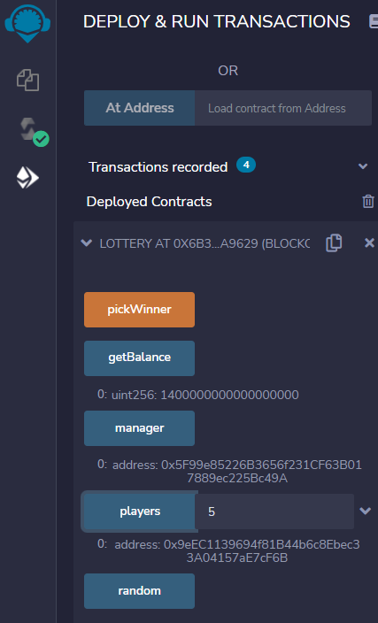

# Lottery_Smart_Contract
Use Solidity to create a lottery that will randomly pick a winner, when at least 3 entrants are present. Each entry is worth 0.2 ETH, and when the winner is randomly selected, the funds from the lottery contract will be transferred to that address.

---

## Technologies & Installation Guide

This project leverages python 3.7 and solidity 0.8.0 with the following packages:

1. Ganache Test Blockchain

2. MetaMask Decentralized Wallet

Let's begin by installing Ganache:

**[Ganache Test BlockChain](https://trufflesuite.com/ganache/)** - Follow the installation instructions for your Operating System.

Now, let's intall MetaMask, and we'll be ready to run this lottery:

**[Metamask Digital Wallet](https://metamask.io/)** - Follow the installation instructions for your Operating System.

We are now done with all of the installations we need to run our application.

---

## Usage Guide

We need to begin with our connections to Ganache and MetaMask. We will be using Ganache as our test blockchain and MetaMask as our EOA (Externally Owned Account). We use MetaMask for its decentralized nature. 

When you open Ganache, select the `QUICKSTART` option. Once you have the test blockchain running, go to the settings icon and change the name of the test chain to `LOTTERY` in order to save this workspace. 

In the preceding image we can see the name of the workspace was updated to `LOTTERY`, and we have several accounts, each starting with a balance of 100 ETH.

Next, we need to import our Ganache accounts into MetaMask:

From the Ganache `ACCOUNTS` tab, click on the key icon, to the far-right of the first account. When the `PRIVATE KEY` appears, copy it so we can paste it in MetaMask. 

Once you return to MetaMask, click on `Import Account`, and when prompted, paste the private key from Ganache in the field provided. 

We must now connect the account in MetaMask to Remix:

When you re-launch MetaMask, there will be a message asking us to connect the account we just imported. Click on `Connect` and this account will now be connected to Ganache, MetaMask, and Remix. 

Let's change the account's name to something we'll associate with this project:

Let's call this first account `FIRST`. 

We also need to make sure that we change our Virtual Machine from the `Javascript VM` to `Injected WEB3`:

In the `ENVIRONMENT` field of the `DEPLOY` section, in the Remix sidebar, select `Injected Web3`. This will help us make use of our Ganache and MetaMask connections to deploy and test this contract. 

Before continuing to compiling and deploying our contract, we should import at least 4 more accounts from Ganache into MetaMask. The lottery needs at least 5 entries in order to pick a winner. We have only imported 1 account, so we need to import a few more in order to be able to conduct the lottery. In our case, we imported a total of 6 accounts.

It is now time to compile our smart contract:

Make sure you are selecting the correct compiler, in this case `0.8.7+commit.e28d00a7`. Once the correct compiler is selected click on the blue `Compile lottery.sol` button to compile. 

If there are no compilation errors, we should see a green check mark next to the compile icon. 

Great! Now that we have a successfully compiled contract, we can deploy it:

Click on the deploy icon, below the compile icon, to be taken to the deployment section. In the `Contract` field, we need to make sure we are deploying the correct contract, for us this is `Lottery-Udemy-Master Ethereum & Solidity/lottery.sol`. Once the correct contract is selected, we open MetaMask and make sure we are working with the account labeled `FIRST`. This will be the account that deploys the contract, and thus the contract's manager. Once the correct account and contract are selceted, we click on the orange `Deploy` button. 
You will be prompted by MetaMask to confirm the transaction. Click on the blue `Confirm` button to authorize the transaction. 
Congratulations! We have now compiled and deployed our Lottery Smart Contract. 

We can use the Remix IDE to verify that our contract was deployed successfully:

In the `Terminal` view of the Remix IDE we can see a confirmation. It has a green check mark stating `true Transaction mined and executed succeed`. It also provides us with the transaction hash. We have now confirmed our contract deployment. 

We can also verify the contract creation through Ganache:

In the Ganache workspace, click on the `TRANSACTIONS` tab to review the transactions. We only have one transaction and this transaction receipt displays a red label reading `CONTRACT CREATION`. This confirms that our contract was created. 

We can also check the balance of the account that deployed the contract. In our case, the first Ganache account:

We can see that this account now has a balance of 99.99 ETH. It started with 100 ETH. This is because in order to deploy the contract, this account needed to pay the gas fee for executing the transaction. Therefore, they now have less than the 100 ETH they began with. 

We can also verify the `FIRST` account's balance via MetaMask:

We can see here the exact amount of this account's balance. It also confirms for us that this account deployed the contract. 

Lets now switch to the `SECOND` account in order to enter the lottery:

We can see here that we are, in fact, working with the `SECOND` account. We are going to enter the lottery with this account.

We will use the Remix IDE sidebar in order to interact with the contract. However, this method does not allow us to input decimals. So we need to convert our 0.2 ETH to wei. To accomplish this we can go to **[ETH Converter](https://eth-converter.com/)**. 

In the `Ether` field, input 0.2, as that is the lottery entry amount. This should auto-populate the `Wei` field. Copy the amount of wei so we can input this into the `VALUE` field of the deployment section. 

In the deployment section of the Remix IDE, right above the `CONTRACT` field is the `VALUE` field. This is where we paste the amount of Wei to execute this transaction. Make sure you select `Wei` from the dropdown menu. 

Once we open up the contract functions, we should see a section labeled `Low level interactions`. Within that section you should see a button reading `Transact`. Once you click on that button, the transaction will be started. 

We will be prompted by MetaMask to confirm the transaction:

Paying attention to the value, it reads 0.2 ETH, so we are sending the correct amount to enter the lottery. 

We must now confirm the transaction through MetaMask:

Once we've verified that the entry amount is correct, we click on the blue `Confirm` button to execute the transaction. 

Now, we can verify this transaction via the Remix IDE:

In the `Terminal` view of the Remix IDE we can see that the transaction was successful. It has a green check mark, the status states: `true Transaction mined and execution succeed`, and it also provides us with the transaction hash. 

Let's turn to Ganache to verify our transaction via our test blockchain:

When we click on the `TRANSACTIONS` tab, we can see that there are two transactions. The first one was the contract creation, and the second is the latest contract call when the first lottery entry was made. 

Let's check the contract's balance after this first entry. It is extremely important to make sure that we are checking the balance with the `FIRST` account. This is because this address is the contract's manager, and it is required that **ONLY** the contract manager is authorized to check balance. 

Once the contract manager, (`FIRST` account), clicks on the `getBalance` function, we should see the balance of 0.2 ETH, in Wei.  

Great! We now have one entry into our lottery. 
Now, we must submit at least 4 more entries before we can pick a winner.

For the next entry, we'll submit the payment via MetaMask instead of interacting with the contract through the Remix IDE. 

We can copy the contract's address either through Remix or Ganache. Then, from MetaMask, click on `Send`. In the address field, paste the contract's address. Then, in the `Amount` field, enter 0.2 ETH. The Gas Price should automatically populate. Once we are ready to execute the transaction, we click the blue `Next` button. 

We now need to confirm the transaction via MetaMask:

Before we confirm the transaction, we just need to verify that the amount we are sending is correct. In this case, we see that we are sending 0.2 ETH to the contract. So we can confirm this transaction. 

Let's verify that we interacted with the contract via Metamask:

As we can see, account `SECOND` sent 0.2 ETH to the contract. We can see their balance debited this amount, plus the gas fee, and the `Activity` tab states that we have interacted with the contract. 

Let's check the contract's balance after this second entry:

We can now see that the contract's balance is 0.4 ETH, in Wei. So we have successfully entered 2 accounts into the lottery.

One interesting aspect of this lottery is that the same address can enter multiple times:

This is account `SIX`'s first entry into the lottery. They are the player at position 5 of our players' array. 

This is account `SIX`'s second lottery entry. They are the player at position 6 of our players' array. They have now entered the lottery twice so they have a better chance of winning than the other participants. 
We can also see the final balance of the contract. There are 7 total entries. We have six accounts, and account `SIX` entered twice. The balance is 1.4 ETH, in Wei. Once the `pickWinner` function is executed, the winning account will receive this amount.

Now, just to verify that only the contract manager can execute the `pickWinner` function, we will try to execute it using account `SIX`:

This pop-up message stating, `Gas estimation failed`, is our first indication that this account will not be able to execute this transaction. 

Once we click on `Send Transaction`, we will see the transaction fail in two places. First, the `Terminal` view of the Remix IDE will signal that the transaction errored out. 
We can also see a `Failed transaction` message from Metamask on the bottom-right of our screen. This is a great safety measure aimed at preventing just anyone from picking a winner. 

